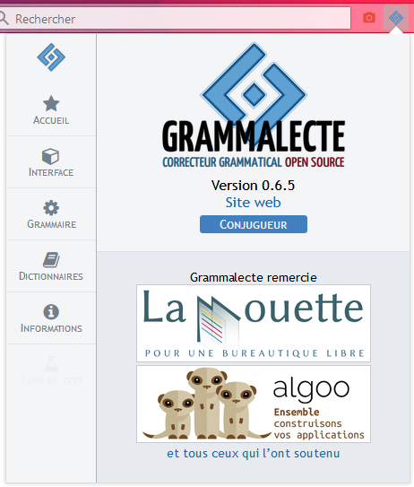

<!--
N.B.: This README was automatically generated by https://github.com/YunoHost/apps/tree/master/tools/README-generator
It shall NOT be edited by hand.
-->

# Grammalecte server pour YunoHost

[](https://dash.yunohost.org/appci/app/grammalecte)  

[](https://install-app.yunohost.org/?app=grammalecte)

*[Read this readme in english.](./README.md)*

> *Ce package vous permet d’installer Grammalecte server rapidement et simplement sur un serveur YunoHost.
Si vous n’avez pas YunoHost, regardez [ici](https://yunohost.org/#/install) pour savoir comment l’installer et en profiter.*

## Vue d’ensemble

Grammalecte is a spelling, grammar and typography checking service that supports French and Occitan. This package installs the server version, that provides an API for use by other programs (like LanguageTool).

**Version incluse :** 2.1.1~ynh2

## Captures d’écran



## Avertissements / informations importantes

## Configuration

The Grammalecte server can be configured by changing the command-line options of the `systemd` service `grammalecte.service`.

## Documentations et ressources

* Site officiel de l’app : <https://grammalecte.net>
* Dépôt de code officiel de l’app : <http://code.grammalecte.net:8080/>
* YunoHost Store: <https://apps.yunohost.org/app/grammalecte>
* Signaler un bug : <https://github.com/YunoHost-Apps/grammalecte_ynh/issues>

## Informations pour les développeurs

Merci de faire vos pull request sur la [branche testing](https://github.com/YunoHost-Apps/grammalecte_ynh/tree/testing).

Pour essayer la branche testing, procédez comme suit.

``` bash
sudo yunohost app install https://github.com/YunoHost-Apps/grammalecte_ynh/tree/testing --debug
ou
sudo yunohost app upgrade grammalecte -u https://github.com/YunoHost-Apps/grammalecte_ynh/tree/testing --debug
```

**Plus d’infos sur le packaging d’applications :** <https://yunohost.org/packaging_apps>